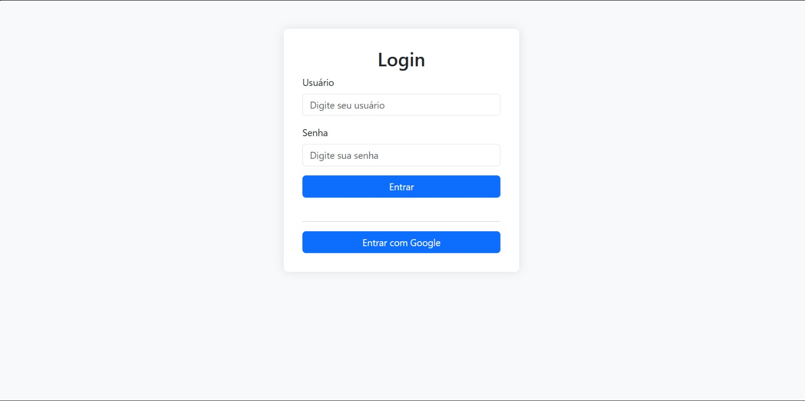
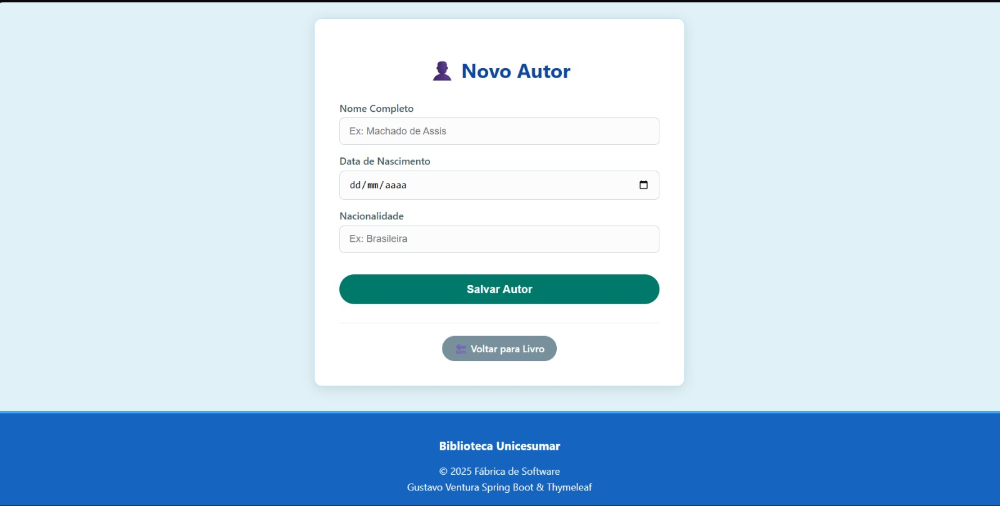
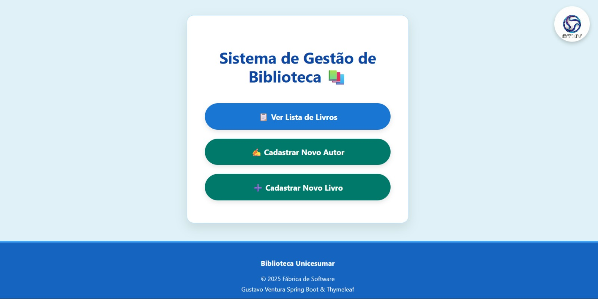

# 📚 Sistema de Gestão de Biblioteca


> Um sistema completo para gerenciamento de acervo bibliográfico, com autenticação Google, controle de autores e livros.

---

## 📸 Screenshots do Projeto

Aqui estão algumas telas do sistema em funcionamento:

<div align="center">
  <h3>Tela de Login (Integração Google)</h3>
  
  
  <h3>Listagem de Livros</h3>
  

  <h3>Cadastro de Livro (Com Validação)</h3>
  

  <h3>Cadastro de Livro (Com Validação)</h3>
  

  <h3>Cadastro de Livro (Com Validação)</h3>
  
</div>

---

## 📝 Descrição

Este projeto é um sistema web robusto para cadastro e gerenciamento de uma biblioteca. Desenvolvido em **Java com Spring Boot**, ele demonstra a aplicação prática de conceitos de Engenharia de Software, MVC, Segurança (OAuth2) e Persistência de Dados.

O objetivo é permitir o registro, consulta, atualização e exclusão (CRUD) de dados de livros e autores, oferecendo uma interface amigável construída com **Thymeleaf**.

---

## ✨ Funcionalidades Principais

- [x] **Autenticação Segura:** Login via Google (OAuth2) e controle de sessão.
- [x] **Gestão de Autores:** Cadastro e vinculação de autores às obras.
- [x] **Gestão de Livros:** Cadastro completo com Título, ISBN, Data, Preço e Gênero.
- [x] **Listagem Inteligente:** Tabela com paginação e botões de ação rápida.
- [x] **Validações de Regra de Negócio:**
    - Preço obrigatório para livros recentes.
    - ISBN único.
    - Gênero não pode ser nulo.
- [x] **Interface Responsiva:** Design limpo e adaptável para dispositivos móveis.

---

## 🚀 Tecnologias Utilizadas

O projeto foi construído utilizando as seguintes tecnologias:

* **Back-end:**
    * ☕ Java 21
    * 🍃 Spring Boot 3 (Web, Data JPA, Security, OAuth2 Client, Validation)
    * 🐘 PostgreSQL (Banco de Dados)
    * 🐳 Docker (Para containerização do banco)
* **Front-end:**
    * 🍃 Thymeleaf
    * 🎨 CSS3 (Estilização Customizada)
    * ☕ JavaScript (Lógicas simples de interface)
* **Ferramentas:**
    * 🛠️ Maven
    * 💻 IntelliJ IDEA
    * 🐙 Git & GitHub

---

## 📂 Estrutura do Projeto

A arquitetura segue o padrão MVC (Model-View-Controller) com camadas de serviço e repositório:

```
src/main/java/com/github/gtvnv/libraryapi
├── 📂 config/          # Configurações de Segurança e Web
├── 📂 controller/      # Controladores (API e View)
│   ├── 📂 dto/         # Objetos de Transferência de Dados
│   └── 📂 mappers/     # Conversores DTO <-> Entity
├── 📂 model/           # Entidades JPA (Livro, Autor, Usuario)
├── 📂 repository/      # Interfaces de acesso ao Banco de Dados
├── 📂 service/         # Regras de Negócio
└── 📂 security/        # Filtros e Lógica de Autenticação Customizada
```

⚙️ Como Rodar o Projeto
Siga os passos abaixo para executar o sistema em sua máquina:

Pré-requisitos
Java JDK 21 instalado.

Maven instalado.

PostgreSQL rodando (local ou via Docker).

Credenciais do Google Cloud Console (Client ID e Secret) para o OAuth2.

Passo a Passo
1 - Clone o Repositório:
git clone [https://github.com/Gtvnv/CadastrarLivros.git](https://github.com/Gtvnv/CadastrarLivros.git)
cd CadastrarLivros

2- Configure o Banco de Dados: No arquivo src/main/resources/application.yml, ajuste as credenciais:
spring:
  datasource:
    url: jdbc:postgresql://localhost:5432/library
    username: seu_usuario
    password: sua_senha

3 - Compile e Execute:
mvn spring-boot:run

4 - Acesse: Abra o navegador em: http://localhost:9090

```
📈 Melhorias Futuras
[ ] Implementar upload de imagem para a capa do livro.

[ ] Criar dashboard com gráficos de livros por gênero.

[ ] Adicionar funcionalidade de empréstimo de livros.

[ ] Implementar testes automatizados (JUnit/Mockito).

[ ] Deploy na nuvem (Render/Heroku/AWS).
```

✉️ Autor
<table align="center"> <tr> <td align="center"> <a href="https://github.com/Gtvnv"> 


<sub><b>Gustavo Ventura Nery Vianna</b></sub> </a> </td> </tr> </table>

<div align="center"> <a href="https://www.linkedin.com/in/gtvnv" target="_blank"></a> <a href="mailto:gutsman1235@gmail.com"></a> </div>
